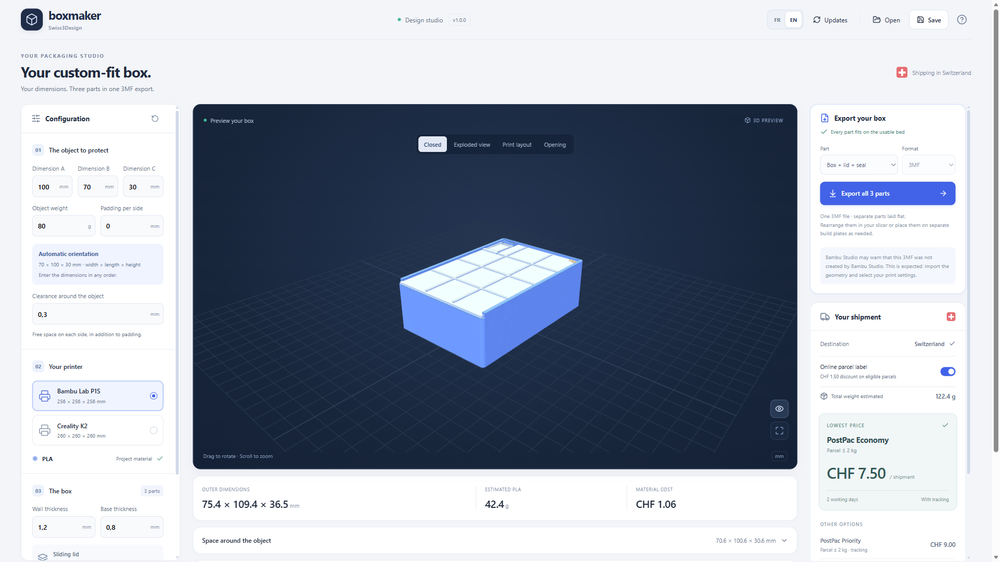

  

<h1 align="center">Boxmaker</h1>

  <strong>A shipping box shaped around your object.</strong> 
  Enter its dimensions, inspect the box in 3D, and export the parts for printing.

  <strong>Windows x64 and ARM64 · macOS</strong> · English & French · Free & open source

  
  &nbsp;&nbsp;
  

  Windows: Intel, AMD, and ARM64 · Mac: Intel and Apple Silicon
   
  <a href="https://apps.microsoft.com/detail/9MX7QLK05FJP">Microsoft Store listing</a>
  ·
  <a href="https://github.com/Thomas-TP/BoxMaker/releases/tag/v1.0.0">Release notes and checksums</a>
  ·
  <a href="docs/USER_GUIDE.md">User guide</a>

---

  

## From your object to a printable box

| | |
| --- | --- |
| **📐 Made to fit** | Enter your object's dimensions and weight. Set the clearance and any extra padding you need. |
| **👀 Preview before printing** | Rotate the 3D model and switch between closed, exploded, open, and print-layout views. |
| **🧩 Three parts, one file** | Export the box, lid, and printable seal together in one 3MF. Each part is also available separately. |
| **📦 Ready to plan a shipment** | Compare Swiss Post options using estimated dimensions and weight, then enter the actual weight of your packed box. |
| **💾 Pick up where you left off** | Your last valid project is recovered automatically after closing or updating. Save project files to keep multiple designs. |
| **🖥️ Preview on more computers** | Interactive 3D includes a fallback for virtual machines and computers without WebGL. |

  

The app is available in **English and French**. It follows your system language on first launch, and you can switch languages any time from the toolbar.

## How it works

1. **Describe your object.** Enter its three dimensions and weight, plus any padding. Choose a printer profile: Bambu Lab P1S or Creality K2.
2. **Adjust the box.** Check the 3D preview and parts. Boxmaker selects a printable orientation for the dimensions you entered.
3. **Export and print.** Save the complete three-part 3MF or individual STL/3MF files, then prepare the print in your slicer.
4. **Seal and weigh.** After printing, close the box and insert the printable seal. Weigh the finished parcel before buying postage.

[Read the user guide →](docs/USER_GUIDE.md)

## Install Boxmaker

Choose the badge for your computer above. On Windows, the official web installer is **signed by Microsoft**, requires an internet connection, and selects x64 or ARM64 automatically. That installation receives updates from Microsoft Store. The same [Windows installer is attached to the GitHub release](https://github.com/Thomas-TP/BoxMaker/releases/download/v1.0.0/Boxmaker-Windows.exe). Windows ARM64 builds are available but have not yet been tested on a user device.

**Mac: one DMG for Intel and Apple Silicon.** Drag Boxmaker to Applications. The app has a free ad hoc signature, without Apple Developer ID or notarization. macOS may require you to allow the first launch in **System Settings → Privacy & Security → Open Anyway**. Version 1.0 adds in-app updates with verified update signatures; users of 0.8.x need to install the new DMG once. The maintainer has tested macOS use in VMware; native Intel and Apple Silicon tests were not separately reported.

On Mac and Windows Velopack installations, **Updates** lets you opt into beta releases or disable startup checks. Stable releases are the default. Updates never restart the app without your action. Microsoft Store installations remain on the Store's stable channel.

## Before your first shipment

> **Check your own print and weigh your shipment.** The maintainer has validated the printed closure, seal, loaded-box transport, and Bambu Studio exports. Results still depend on your printer, PLA, settings, and contents. The seal is an opening indicator, not a guarantee against tampering. Shipping estimates cover domestic Switzerland and use the 2026 rate table. Confirm the final rate with Swiss Post.

Bambu Studio may warn that a 3MF was not created by Bambu Studio. This is expected: import its geometry and choose your printer and filament settings. [Validation details →](docs/VALIDATION.md)

<strong>Can I reuse the seal?</strong>

The seal is designed to break when opened. You can export and print a replacement seal separately.

<strong>Can I reopen a saved project?</strong>

Yes. Save the project on your computer and open it again in Boxmaker. Projects and exports stay on your device.

<strong>Do I need an account?</strong>

No. Box design and export work locally without a Boxmaker account.

## Open source

Boxmaker is available under the **[MIT license](LICENSE)**. Use it, modify it, and contribute improvements. Generated model files and printed boxes can be used commercially. [Contributing →](CONTRIBUTING.md)

---

  <a href="https://github.com/Thomas-TP/BoxMaker/issues">Report an issue</a>
  ·
  <a href="docs/PRIVACY.md">Privacy</a>
  ·
  <a href="docs/DEVELOPMENT.md">Developer documentation</a>

