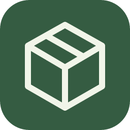
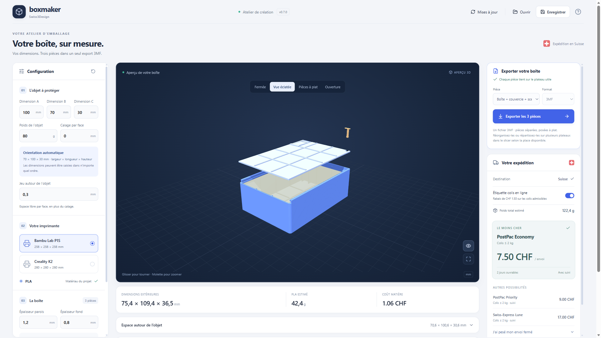
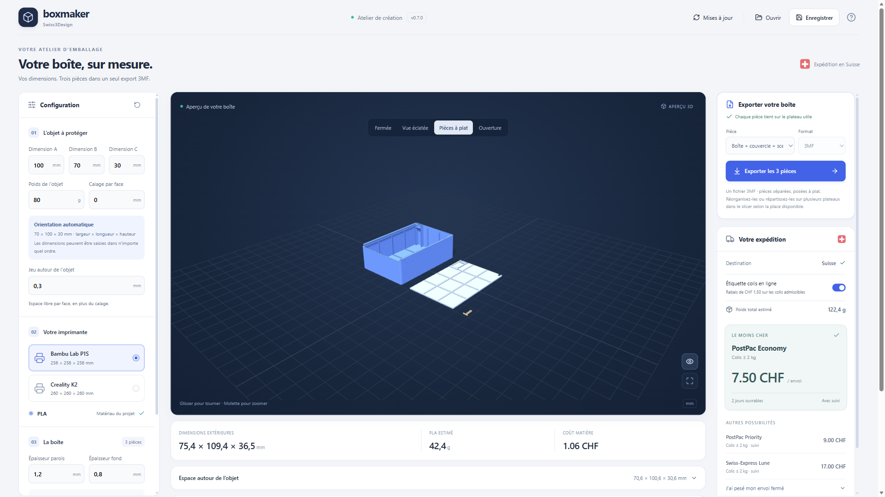

  

<h1 align="center">Boxmaker</h1>

  <strong>Votre boîte d’expédition, dessinée pour votre objet.</strong> 
  Concevez-la en quelques gestes, découvrez-la en 3D, puis imprimez ses pièces.

  <strong>Windows x64 et ARM64 · macOS</strong> · Impression 3D en PLA · Expédition en Suisse

  
   Pour Windows : le Store choisit automatiquement la version x64 ou ARM64 de votre PC.

  <a href="https://apps.microsoft.com/detail/9MX7QLK05FJP">Voir la fiche Store</a>
  ·
  <a href="https://github.com/Thomas-TP/BoxMaker/releases/tag/v0.8.2">Windows et Mac : autres téléchargements</a>
  ·
  <a href="docs/UTILISATION.md">Guide d’utilisation</a>

---

  

## De votre objet à une boîte prête à imprimer

| | |
| --- | --- |
| **📐 Sur mesure** | Entrez les dimensions et le poids de votre objet. Ajoutez du calage si nécessaire, puis ajustez la boîte à votre impression. |
| **👀 Visible avant impression** | Tournez le modèle en 3D et passez des vues fermée, éclatée et ouverte aux pièces posées à plat. |
| **🧩 Trois pièces, un fichier** | Exportez la boîte, le couvercle et le scellé imprimable dans un seul 3MF. Chaque pièce reste aussi disponible séparément. |
| **📦 Pensé pour l’envoi** | Comparez les options de la Poste suisse avec les dimensions et le poids estimés, puis renseignez le poids réel après emballage. |

  

## Comment ça marche ?

1. **Décrivez votre objet.** Saisissez ses trois dimensions, son poids et le calage souhaité. Choisissez votre imprimante : Bambu Lab P1S ou Creality K2.
2. **Ajustez votre boîte.** Inspectez le rendu 3D et les pièces. Boxmaker choisit automatiquement une orientation adaptée aux dimensions saisies.
3. **Exportez et imprimez.** Téléchargez le 3MF des trois pièces ou des fichiers STL individuels, puis préparez l’impression dans votre logiciel de découpe.
4. **Fermez et pesez.** Après impression, fermez la boîte et insérez le scellé imprimé. Pesez le colis terminé avant de choisir son affranchissement.

[Voir le guide détaillé →](docs/UTILISATION.md)

## Installer Boxmaker

Le **badge Microsoft Store** en haut de cette page télécharge l’installateur Web officiel de Boxmaker. Il est signé par Microsoft, nécessite Internet et installe la version adaptée à votre PC. Les mises à jour de cette version passent par le Store.

| Votre appareil | Téléchargement direct sur GitHub |
| --- | --- |
| Windows Intel ou AMD | [Installateur x64](https://github.com/Thomas-TP/BoxMaker/releases/download/v0.8.2/Swiss3Design.Boxmaker-win-Setup.exe) · [ZIP portable](https://github.com/Thomas-TP/BoxMaker/releases/download/v0.8.2/Swiss3Design.Boxmaker-win-Portable.zip) |
| Windows ARM (Snapdragon) | [Installateur ARM64](https://github.com/Thomas-TP/BoxMaker/releases/download/v0.8.2/Swiss3Design.Boxmaker.Arm64-win-arm64-Setup.exe) · [ZIP portable](https://github.com/Thomas-TP/BoxMaker/releases/download/v0.8.2/Swiss3Design.Boxmaker.Arm64-win-arm64-Portable.zip) |
| Mac Intel ou Apple Silicon | [DMG universel — préversion non testée](https://github.com/Thomas-TP/BoxMaker/releases/download/v0.8.2/Boxmaker-0.8.2-macOS-Universal-UNTESTED.dmg) |

Les installateurs Windows directs de GitHub ne sont pas signés : Windows peut afficher « Éditeur inconnu ». Le Store est l’option la plus simple si vous souhaitez une installation signée et des mises à jour automatiques.

**Mac : préversion non testée en conditions réelles.** Le DMG est gratuit, signé localement sans certificat Apple et non notarisé. Après l’avoir glissé dans Applications, macOS peut demander d’autoriser sa première ouverture dans **Réglages Système → Confidentialité et sécurité → Ouvrir quand même**. Les mises à jour Mac se téléchargent pour l’instant depuis les releases GitHub.

## Avant votre premier envoi

> **Faites un essai réel.** Le scellé imprimé est encore un prototype mécanique : vérifiez sa fermeture et sa rupture sur votre imprimante avant de lui confier un colis. Les tarifs et masses affichés sont des estimations pour les envois intérieurs en Suisse ; pesez le paquet fermé et confirmez le tarif auprès de la Poste.

<strong>Le scellé est-il réutilisable ?</strong>

Le scellé est conçu pour se rompre à l’ouverture. Vous pouvez en imprimer un nouveau séparément depuis l’export des pièces.

<strong>Puis-je reprendre un projet plus tard ?</strong>

Oui. Enregistrez votre projet sur votre ordinateur et rouvrez-le dans Boxmaker. Vos modèles et exports restent locaux.

<strong>Faut-il un compte pour créer une boîte ?</strong>

Non. La conception et les exports fonctionnent localement, sans compte Boxmaker.

---

  <a href="https://github.com/Thomas-TP/BoxMaker/issues">Signaler un problème</a>
  ·
  <a href="docs/PRIVACY.md">Confidentialité</a>
  ·
  <a href="docs/DEVELOPMENT.md">Documentation pour développeurs</a>

